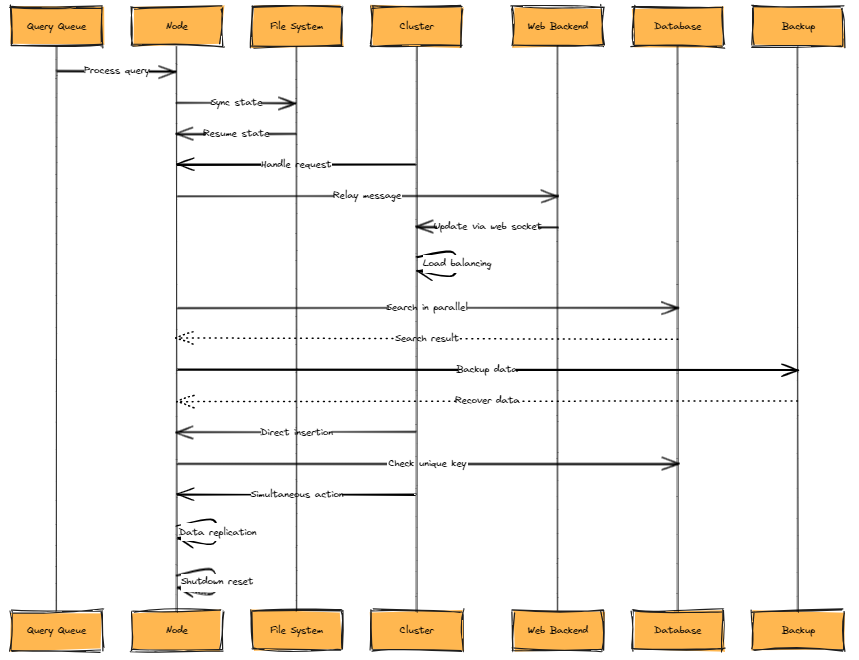
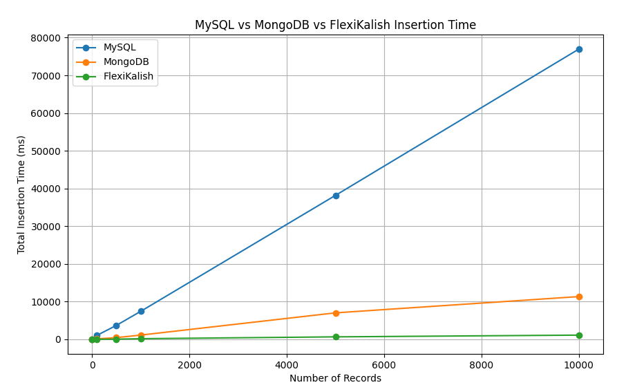

# FlexikalishDB

FlexikalishDB is a schema-less NoSQL database that combines the ease of SQL syntax, similar to MySQL, with the flexibility of NoSQL databases like MongoDB. Designed for real-time, event-driven state management, FlexikalishDB supports high availability and scalability across thousands of nodes. Currently in the Proof of Concept (PoC) stage, continuous updates are planned with a future public release.

## Motivation

Our team faces the challenge of managing complex, event-driven state changes in real-time. The limitations of key-value storage solutions and the fear of maintenance and further development complexities led us to seek a better solution.

I, as the team leader, envisioned a database that not only offers the familiar SQL syntax for ease of use but also provides the flexibility to adapt to changes in the development process, similar to NoSQL databases.

While MongoDB offers relatively easy clustering, it did not fit well with our team, accustomed to relational database management systems (RDBMS). Moreover, we encountered difficulties in managing various scenarios with MongoDB.

Our requirements for real-time updates and the addition of various events necessitated a schema-less database that we could customize as needed.

## Architecture

## Compression Algorithm: DEFLATE

DEFLATE, developed in the early 1990s by Phil Katz, combines the LZ77 algorithm and Huffman coding. This algorithm, known for its excellent compression rate and speed, is widely used in formats such as PNG, gzip, and zip files.

### Key Components

- **LZ77 Algorithm**: Compresses data by replacing repeated data patterns with references (position and length). This efficiently encodes repeating strings within the data stream.
- **Huffman Coding**: Assigns optimal variable-length codes based on the frequency of each character. Frequent characters receive shorter codes, while rare characters receive longer codes, reducing the overall data size.

### How It Works

- **Compression**: Scans the input data stream for repeating patterns, encoding them with the LZ77 algorithm. The resulting literals and length/distance pairs are further compressed with Huffman coding.
- **Decompression (INFLATE)**: Decompresses the data stream by performing Huffman decoding and restoring the original data patterns using the LZ77 algorithm.

## INFLATE Algorithm

INFLATE reverses the process of DEFLATE compression, restoring compressed data to its original state. This decompression process uses information generated during the compression phase, contained within the compressed data stream.

## Benchmark (MySQL vs MongoDB vs FlexiKalish)
